Font Preview
----

## Programming fonts

Font Name | Light | Dark
---- | ---- | ----
[Cascadia code](https://github.com/microsoft/cascadia-code) | 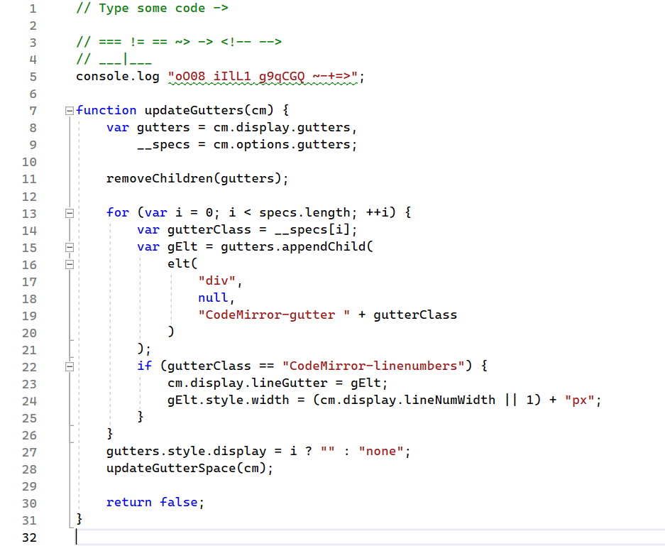 | 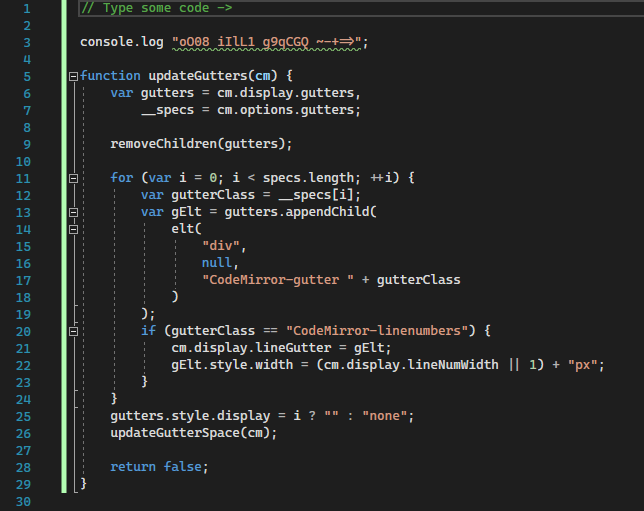
[Consolas](https://github.com/PiotrGrochowski/Consolas) | 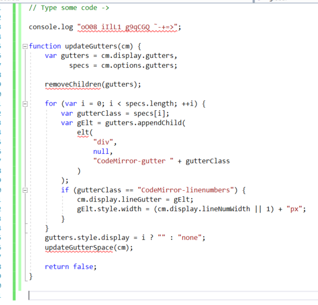 | 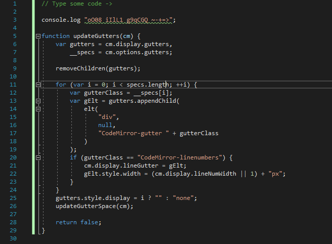
[DejaVuSansMono-Bront](https://github.com/chrismwendt/bront) |  | 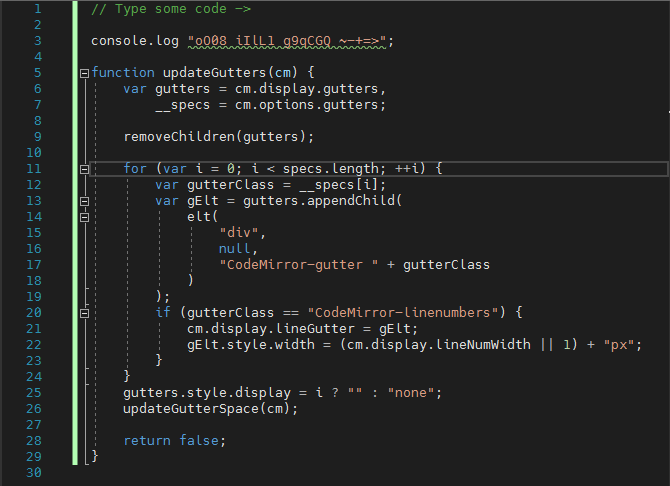
[Hack](https://github.com/source-foundry/Hack) | 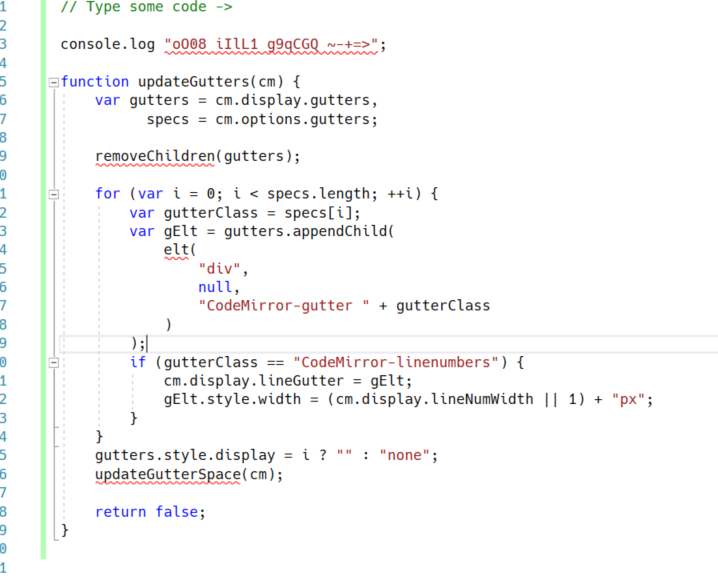 | 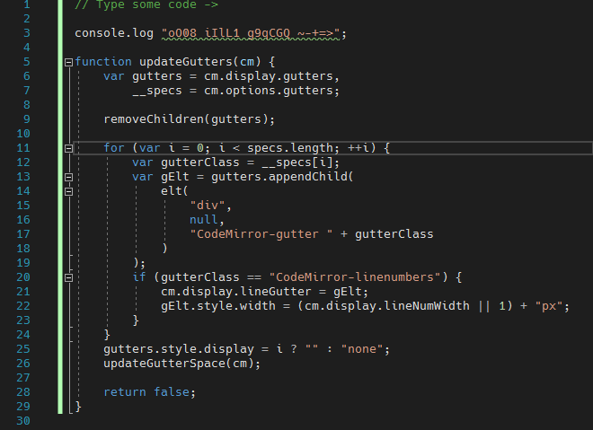
[Meslo-Font](https://github.com/andreberg/Meslo-Font) | 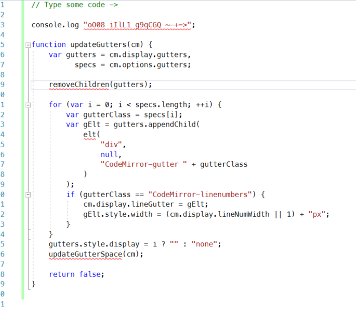 | 
[Mononoki](http://madmalik.github.io/mononoki/) | 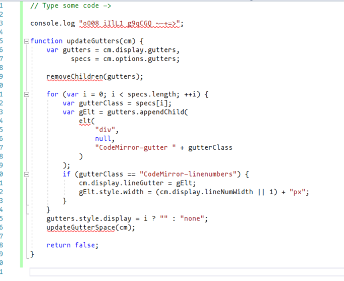 | 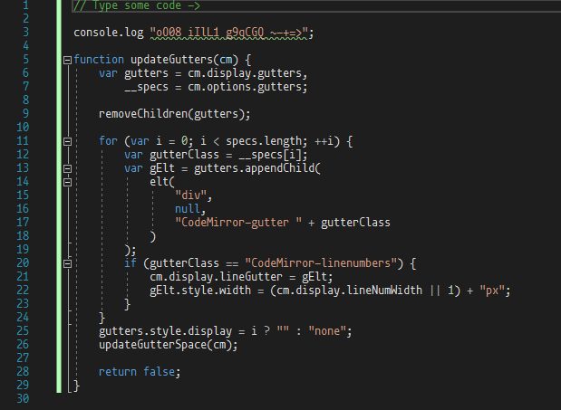
[Source Code Pro](https://github.com/adobe-fonts/source-code-pro) | 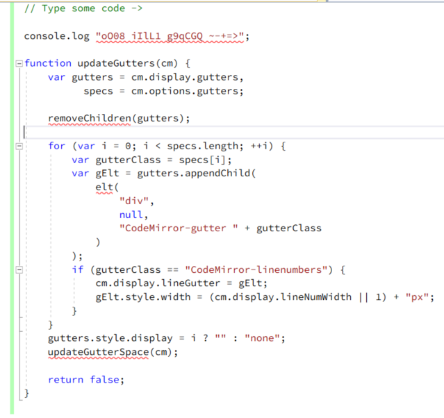 | 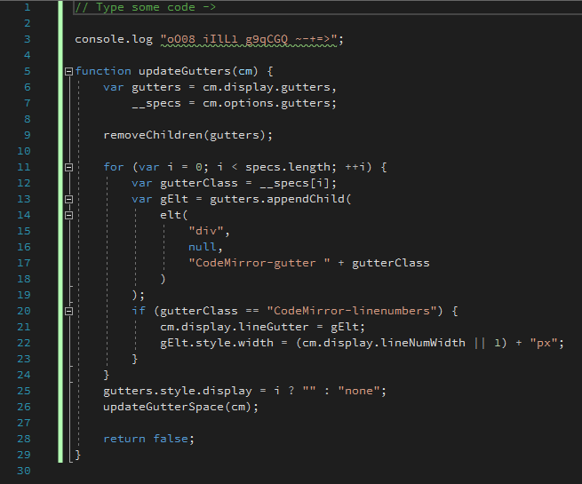
